# **Domapel Sistema de Gerenciamento**

*O sistema de gerenciamento de pedidos da empresa Domapel, foi criado com o objetivo de facilitar a gestão tanto dos clientes, quanto para criação e impressão de pedidos.*

---

## **📋 Funcionalidades**
- 🗂 **Gerenciamento de pedidos**: Cadastro, edição e exclusão de pedidos.
- 📈 **Paginação customizada**: Navegação entre registros com botões estilizados.
- 📑 **Filtros avançados**: Pesquisa por data, cliente, vendedor, e etc solicitados pela empresa.
- 💲 **Cálculo de valores**: Automatização de comissão, geração de relatórios com descontos e totais.
- 🌐 **Design responsivo**: Adaptado para diferentes tamanhos de tela.

---

## **🖼️ Prévia do Sistema**

### **Página de login**
A página de login foi criada para ser facil e intuitiva além de possuir uma interface amigável ao usuário.
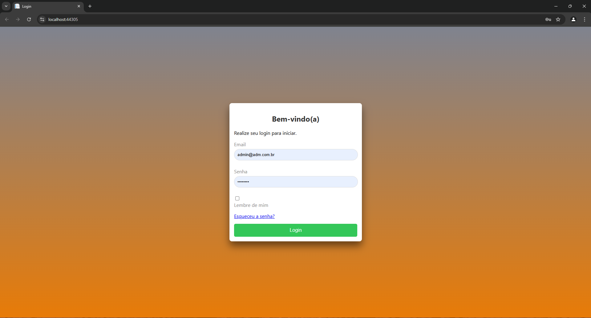  

### **Pedidos**  
A página inicial exibe os pedidos com opções de filtro solicitados pela empresa, além de possuir uma paginação e botões estilizados. Também é possível fazer a edição, e inclusão de novos, podendo também fazer a impressão dos mesmos.
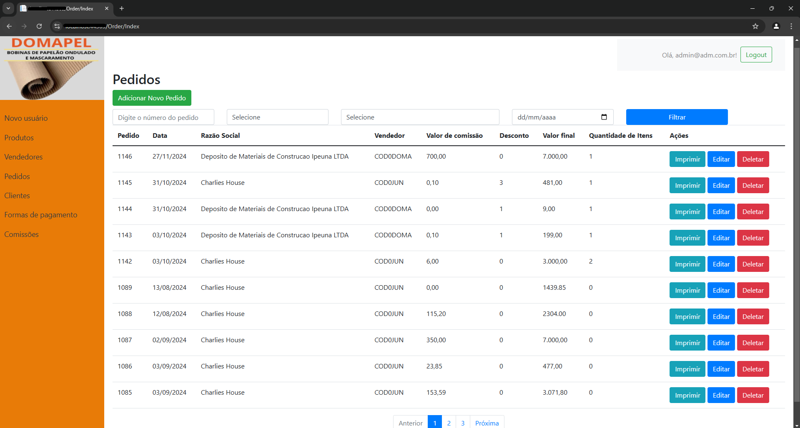  
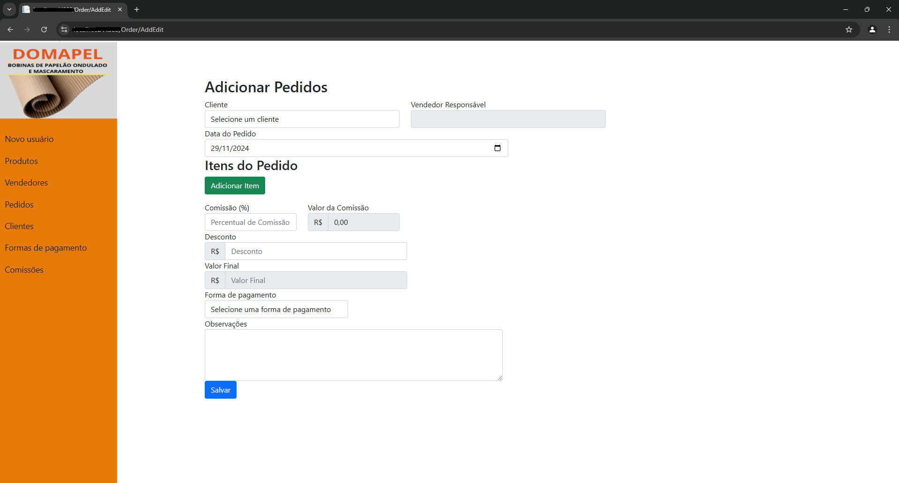  
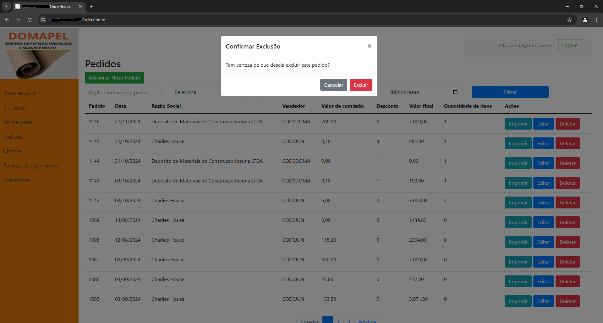  
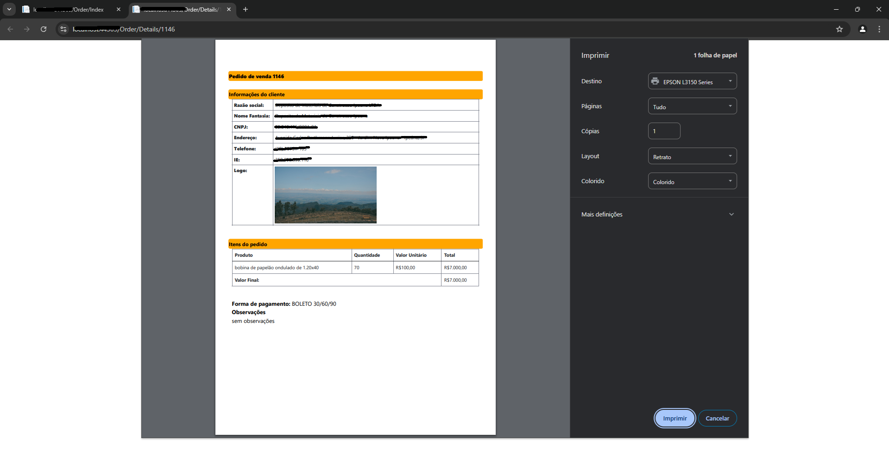

### **Novo Usuário**
É possível realizar a criação de novos usuários no sistema.
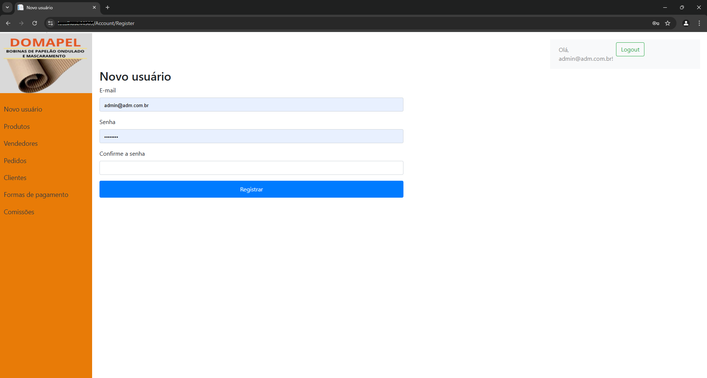  

### **Produtos**
Listagem de todos os produtos, edição dos mesmos e criação de novos.
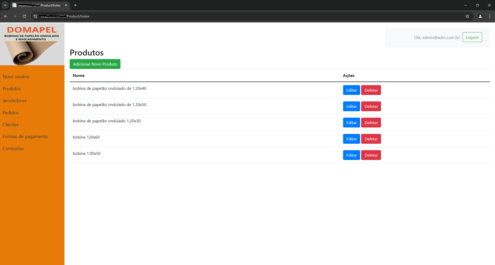  
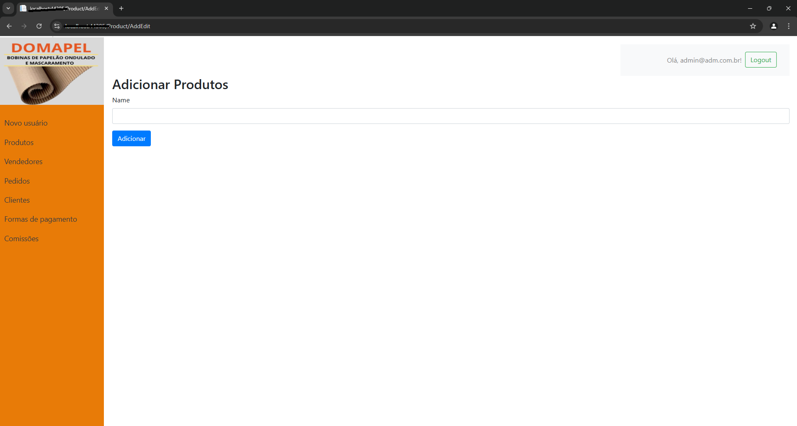  

### **Novo Representantes Comerciais**
Listagem de representantes comerciais, assim como edição e criação de novos.
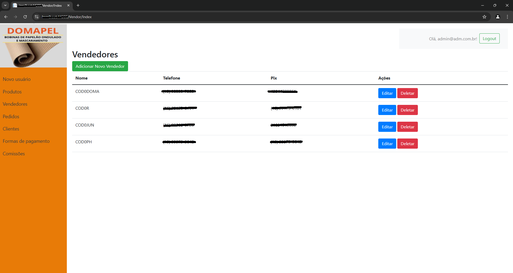  
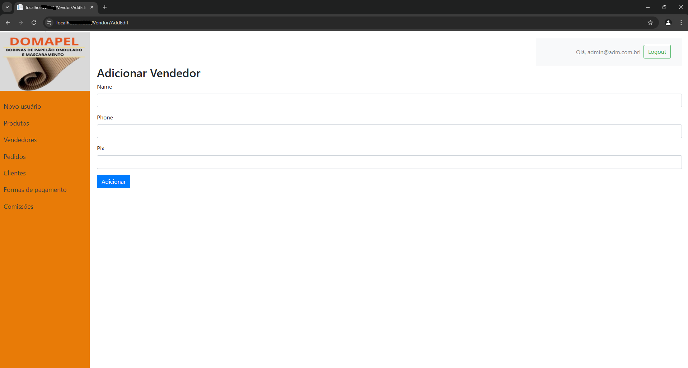  

### **Novo Cliente**
Exibição, criação e edição de clientes.
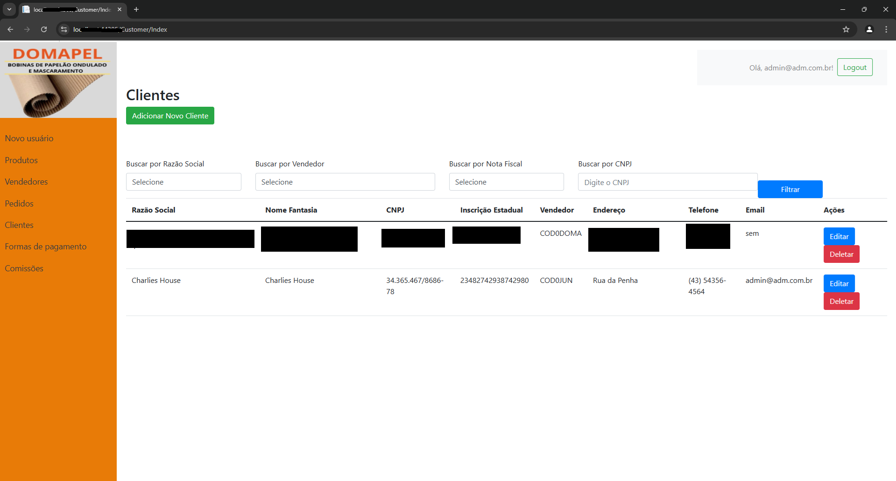  
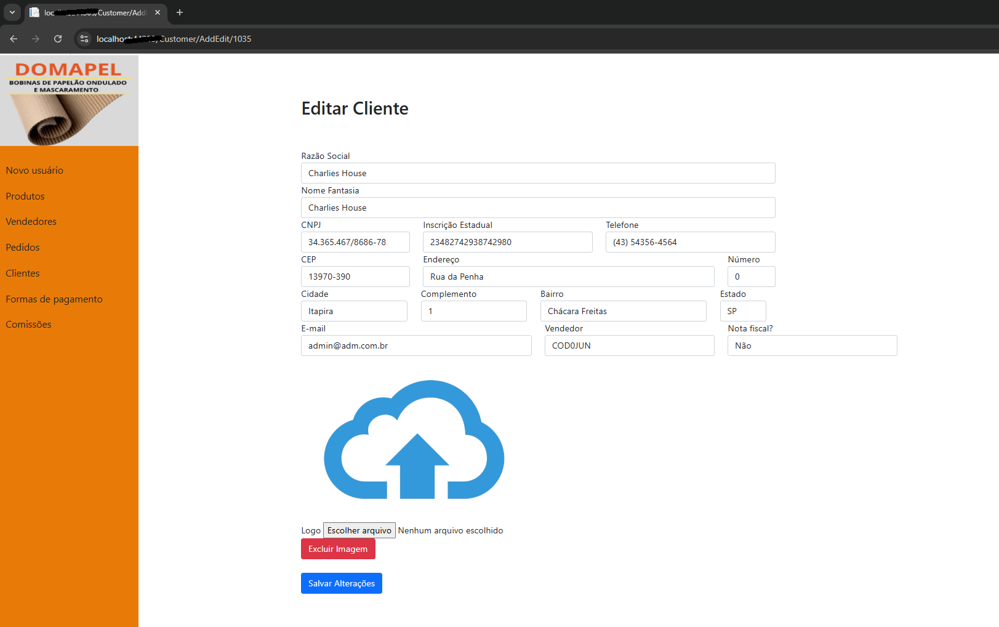 
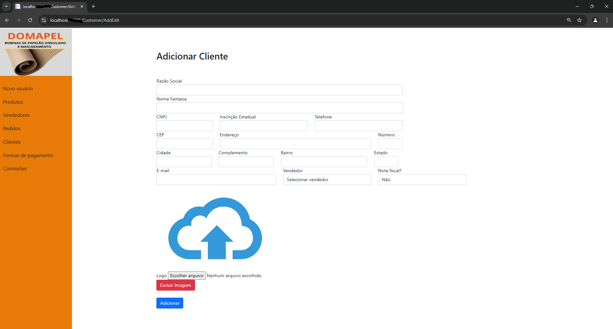  

### **Formas de pagamento**
É possível visualizar e fazer a criação de novas formas de pagamento no sistema.
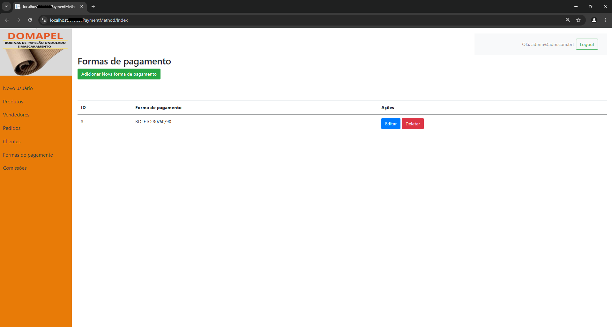  

### **Comissões**  
Visualização de comissões filtradas por representante comercial e pedidos, afim de fazer o fechamento mensal. É possível também baixar um relátorio contendo todas essas informações.
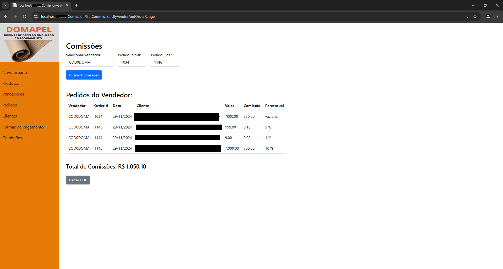  
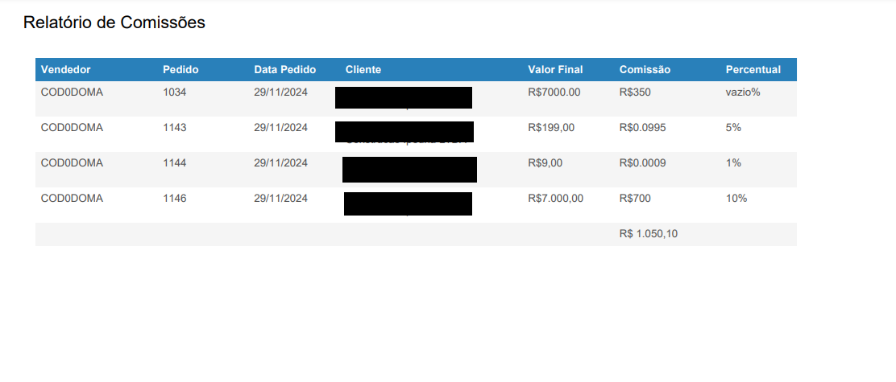
